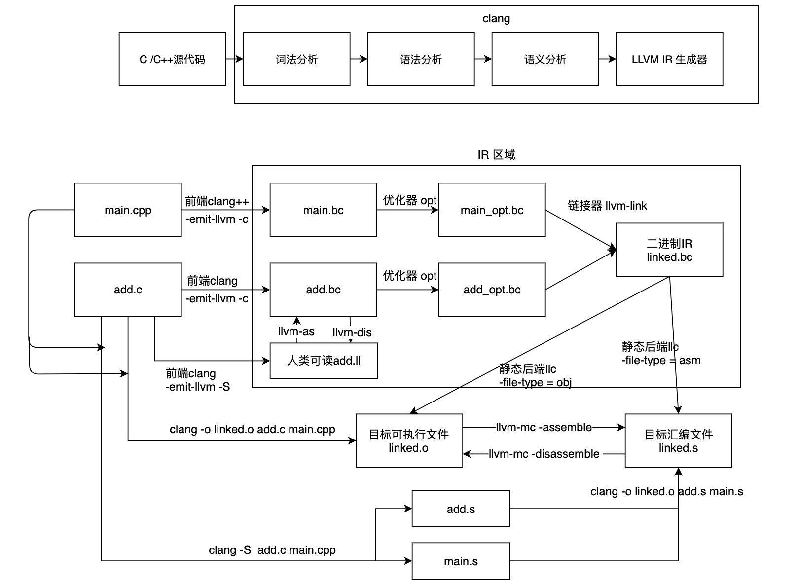
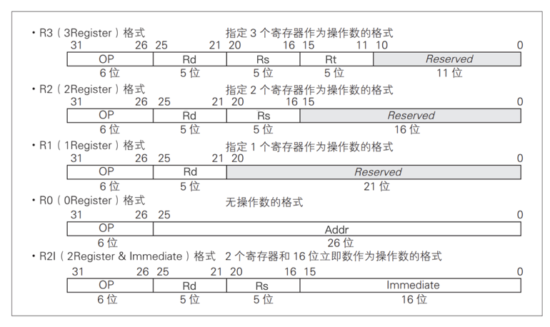
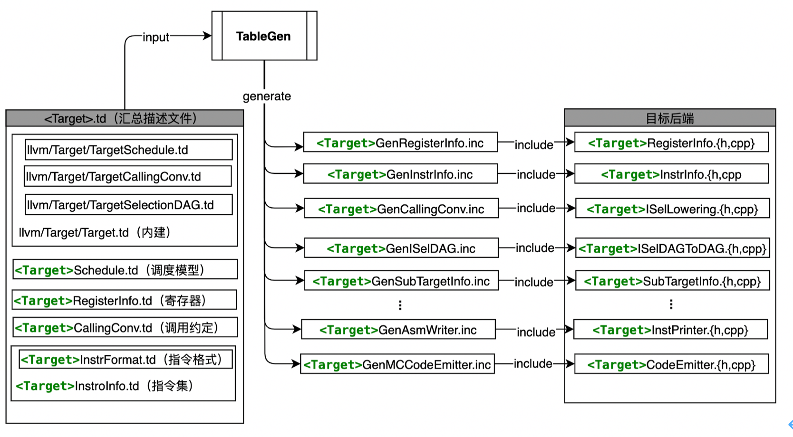
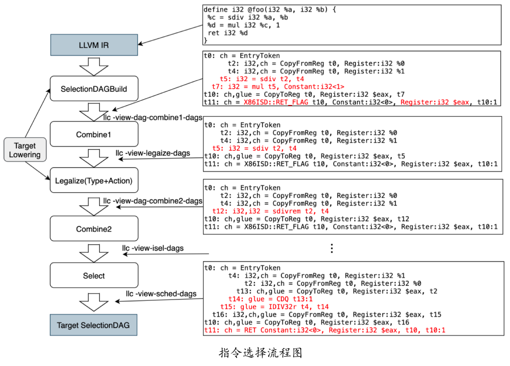
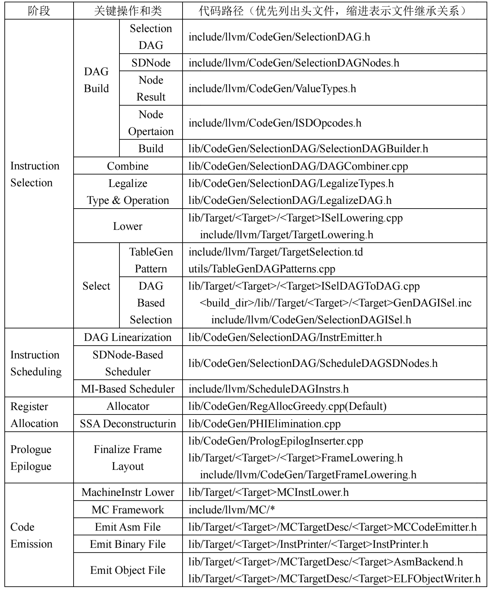

[toc]
# The LLVM Compiler Infrastructure

This directory and its subdirectories contain source code for LLVM,
a toolkit for the construction of highly optimized compilers,
optimizers, and runtime environments.

LLVM is open source software. You may freely distribute it under the terms of
the license agreement found in LICENSE.txt.

Please see the documentation provided in docs/ for further
assistance with LLVM, and in particular docs/GettingStarted.rst for getting
started with LLVM and docs/README.txt for an overview of LLVM's
documentation setup.

If you are writing a package for LLVM, see docs/Packaging.rst for our
suggestions.

# UPT Backend
This is a simple example LLVM backend for an UPT architecture - An self define CPU for my master degree thesis

## Build and Usage
todo

[LLVM运行测试说明文档](/docs/UPT_FUN/LLVM运行测试文档.pdf)

## Instruction Set Architecture

## Target-independent Code Generator
todo

### Summary

## Implementation detail
todo
## Regression Test
todo

# Materials

**I will update some practical videos and documentation for the development of the compiler backend**

**Except for those related to code generation algorithms such as instruction selection and register allocation,there are few papers involved here,  as most of them are not practical**

**A good place is [[llvm dev mailing list]](https://groups.google.com/forum/#!forum/llvm-dev),you can find answers for those tricky problem in practical banckend development**

**Hopefully it will help you**
## LLVM Introduction 

[2019 LLVM Developers’ Meeting: J. Paquette & F. Hahn “Getting Started With LLVM: Basics”](https://www.youtube.com/watch?v=3QQuhL-dSys&t=1253s)

[2019 LLVM Developers’ Meeting: E. Christopher & J. Doerfert “Introduction to LLVM”](https://www.youtube.com/watch?v=J5xExRGaIIY&t=3299s)

[Bud17-302 LLVM Internals #2](https://www.youtube.com/watch?v=9h0zDr4GtsY&t=471s)

## TableGen

### llvm doc

http://llvm.org/docs/TableGen/index.html

http://llvm.org/docs/TableGen/LangIntro.html

## Important Data Structure in Backend

### IR

http://llvm.org/devmtg/2019-04/slides/Tutorial-Bridgers-LLVM_IR_tutorial.pdf

### MI Layer

[The LLVM Machine Representation](http://llvm.org/devmtg/2017-10/slides/Braun-Welcome%20to%20the%20Back%20End.pdf)

### MC-Layer

http://blog.llvm.org/2010/04/intro-to-llvm-mc-project.html

https://www.embecosm.com/appnotes/ean10/ean10-howto-llvmas-1.0.html

## Backend Tutriol

### llvm doc

http://llvm.org/docs/CodeGenerator.html

https://llvm.org/docs/WritingAnLLVMBackend.html

[Tutorial: Creating an LLVM Backend for the Cpu0 Architecture](http://jonathan2251.github.io/lbd/index.html#)

### Lectures

https://github.com/FrozenGene/presentation/blob/master/pdf/LLVM.pdf

https://www.cs.cmu.edu/afs/cs/academic/class/15745-s11/public/lectures/

https://lagunita.stanford.edu/login?next=/courses/Engineering/Compilers/Fall2014/course

## Instruction Selection

### paper or book

[Instruction selection: principles, methods, and applications](https://books.google.com/books?hl=zh-CN&lr=&id=yp9PDAAAQBAJ&oi=fnd&pg=PR7&dq=Survey+on+instruction+selection&ots=A1XWKlm0N3&sig=tmiA2pVo1r40CH7OnFuIlJLMNQY)

### GlobalIsel

[2016 LLVM Developers’ Meeting: A. Bougacha & Q. Colombet & T. Northover “Global Instr.."](https://www.youtube.com/watch?v=6tfb344A7w8&t=602s)

[GlobalISel - LLVM's Latest Instruction Selection Framework](https://www.youtube.com/watch?v=rGDSKGhOiRw&t=448s)

[2017 LLVM Developers’ Meeting: “GlobalISel: Past, Present, and Future ”](https://www.youtube.com/watch?v=McByO0QgqCY&t=2076s)

## Instruction Sechedule 指令调度

### Basic concept

https://en.wikipedia.org/wiki/Instruction_scheduling

### Lecture-pdf

https://engineering.purdue.edu/~milind/ece468/2015fall/lecture-08-6up.pdf

https://www.cl.cam.ac.uk/teaching/2005/OptComp/slides/lecture14.pdf

http://infolab.stanford.edu/~ullman/dragon/w06/lectures/inst-sched.pdf

### Meeting videos

[2017 LLVM Developers’ Meeting: “Writing Great Machine Schedulers ”](https://www.youtube.com/watch?v=brpomKUynEA&t=529s)

### LLVM dev mail lists

http://llvm.org/devmtg/2012-11/Larin-Trick-Scheduling.pdf

https://llvm.org/devmtg/2014-10/Slides/Estes-MISchedulerTutorial.pdf

### Very good videos

[LLVM Instruction Scheduling (MI Scheduler)](https://www.youtube.com/watch?v=cWLW0aQwFg0)

[LLVM pre-RA Scheduler](https://www.youtube.com/watch?v=xBTdEwgtTPM&t=1272s)

[Latency Calculation in Instruction Scheduling](https://www.youtube.com/watch?v=6oghpwbDeVU)

## Register Allocation

### llvm blog

http://blog.llvm.org/2011/09/greedy-register-allocation-in-llvm-30.html

### good videos

[Register Coalescer in LLVM](https://www.youtube.com/watch?v=95zwc8tztNE)

[Slot Index, Live Range, and Live Interval](https://www.youtube.com/watch?v=U_eaHWm5emM&t=957s)

[LLVM Register Pressure](https://www.youtube.com/watch?v=rkBSi-tFP9U)

[Introduction to SSA](https://www.youtube.com/watch?v=1JqW0MDVvVM)

[2018 LLVM Developers’ Meeting: M. Braun “Register Allocation: More than Coloring”](https://www.youtube.com/watch?v=IK8TMJf3G6U&t=1232s)

### Paper

Linear Scan register allocation for the Java HotSpot client compiler

## Code Emission

### Some concept

https://en.wikipedia.org/wiki/Linker_(computing)#Relocation

### good videos

[Relaxation in Debug Information](https://www.youtube.com/watch?v=xu5ZfpDfMWM)

## Backend Test

http://llvm.org/docs/TestingGuide.html

[2019 LLVM Developers’ Meeting: Homerding & Kruse “Getting Started with the LLVM Testing Infra..”](https://www.youtube.com/watch?v=isVQ8kYqaSA&t=972s)

https://llvm.org/docs/CommandGuide/FileCheck.html

## Other Backends

[2018 LLVM Developers’ Meeting: A. Bradbury “LLVM backend development by example (RISC-V)”](https://www.youtube.com/watch?v=AFaIP-dF-RA&t=2217s)

[2019 LLVM Developers’ Meeting: A. Bradbury “Maturing an LLVM backend: Lessons learned from the...”](https://www.youtube.com/watch?v=hT_0HaXW_Io)

https://reup.dmcs.pl/wiki/images/7/7a/Tricore-llvm-slides.pdf

[llvm riscv backend commit patches ](https://github.com/lowRISC/riscv-llvm)

[Leon llvm backend](https://indico.esa.int/event/146/contributions/848/attachments/938/1125/09_-_LLVM_compiler_...pdf)
Goldberg C J. The Design of a Custom 32-bit RISC CPU and LLVM Compiler Backend[J], 2017.

## Other articals

###  Parameter Passing

https://courses.cs.washington.edu/courses/cse410/09sp/examples/MIPSCallingConventionsSummary.pdf

[Parameter (computer programming)](https://en.wikipedia.org/wiki/Parameter_(computer_programming))     

http://user.it.uu.se/~kostis/Teaching/KT1-11/Slides/handout13.pdf

[LLVM:PowerPC assembly language tour](https://srinivasrvaidya.wordpress.com/2018/05/11/powerpc-assembly-language-tour-abi-function-call-and-parameter-passing/)   

http://jonathan2251.github.io/lbd/funccall.html#dynamic-stack-allocation-support

[variable-sized-objects-on-the-stack](https://stackoverflow.com/questions/36562685/variable-sized-objects-on-the-stack)

